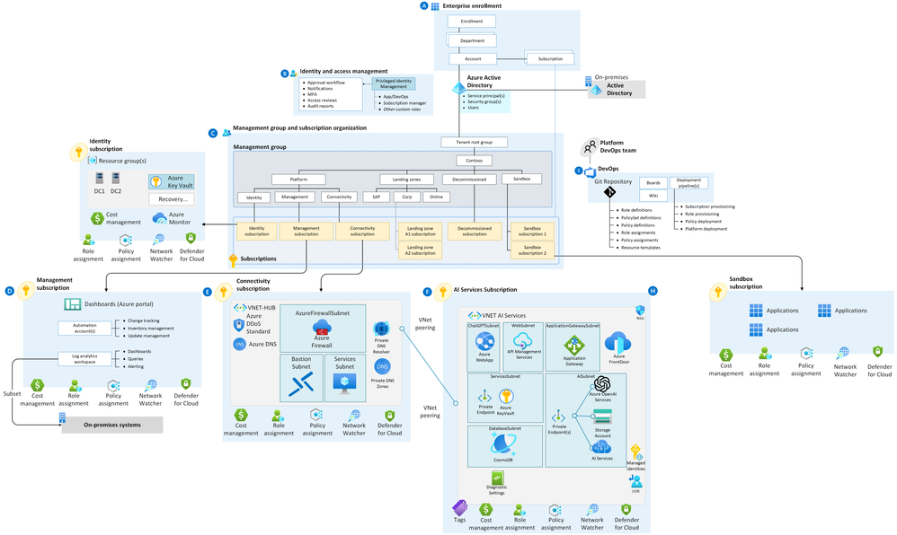

# Azure OpenAI Service - Landing Zone Hack
[Azure OpenAI Service](https://learn.microsoft.com/en-us/azure/ai-services/openai/overview) provides REST API access to OpenAI's powerful language models including the GPT-4, GPT-35-Turbo, and Embeddings model series. These models can be easily adapted to your specific task including but not limited to content generation, summarization, semantic search, and natural language to code translation.

When deploying complex services such as Azure OpenAI, using a Landing Zone approach helps you manage your resources in a structured, consistent manner, ensuring governance, compliance, and security are properly maintained. The [Azure OpenAI Landing Zone](https://techcommunity.microsoft.com/t5/azure-architecture-blog/azure-openai-landing-zone-reference-architecture/ba-p/3882102) is a reference architecture that integrates a variety of services to create a seamless infrastructure for running OpenAI workloads.

For enterprise deployments of Azure OpenAI Service, it is recommended to utilise Azure API Management to provide comprehensive logging and monitoring and enhanced security of the API. This combination enables advanced logging capabilities for tracking API usage and performance and robust security measures to help protect sensitive data and help prevent malicious activity.

## Hacks

1. [Hack 1 - Deploy Azure OpenAI](./hacks/01-deploy-azure-openai.md)
1. [Hack 2 - Implement Chargeback](./hacks/02-implement-chargeback.md)

## Resources and contributions

* [Azure OpenAI Landing Zone reference architecture](https://techcommunity.microsoft.com/t5/azure-architecture-blog/azure-openai-landing-zone-reference-architecture/ba-p/3882102) by [Freddy Ayala](https://techcommunity.microsoft.com/t5/user/viewprofilepage/user-id/1940863)

* [Implement logging and monitoring for Azure OpenAI models](https://learn.microsoft.com/en-us/azure/architecture/ai-ml/openai/architecture/log-monitor-azure-openai)

* [Calculating Chargebacks for Business Units/Projects Utilizing a Shared Azure OpenAI Instance](https://techcommunity.microsoft.com/t5/apps-on-azure-blog/calculating-chargebacks-for-business-units-projects-utilizing-a/ba-p/3909202) by [Shikha Sinha](https://techcommunity.microsoft.com/t5/user/viewprofilepage/user-id/1566597#profile)

## Contributing

This project welcomes contributions and suggestions.  Most contributions require you to agree to a
Contributor License Agreement (CLA) declaring that you have the right to, and actually do, grant us
the rights to use your contribution. For details, visit https://cla.opensource.microsoft.com.

When you submit a pull request, a CLA bot will automatically determine whether you need to provide
a CLA and decorate the PR appropriately (e.g., status check, comment). Simply follow the instructions
provided by the bot. You will only need to do this once across all repos using our CLA.

This project has adopted the [Microsoft Open Source Code of Conduct](https://opensource.microsoft.com/codeofconduct/).
For more information see the [Code of Conduct FAQ](https://opensource.microsoft.com/codeofconduct/faq/) or
contact [opencode@microsoft.com](mailto:opencode@microsoft.com) with any additional questions or comments.

## Trademarks

This project may contain trademarks or logos for projects, products, or services. Authorized use of Microsoft 
trademarks or logos is subject to and must follow 
[Microsoft's Trademark & Brand Guidelines](https://www.microsoft.com/en-us/legal/intellectualproperty/trademarks/usage/general).
Use of Microsoft trademarks or logos in modified versions of this project must not cause confusion or imply Microsoft sponsorship.
Any use of third-party trademarks or logos are subject to those third-party's policies.
