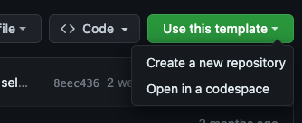
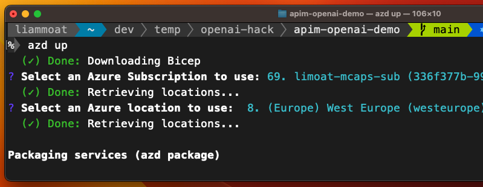
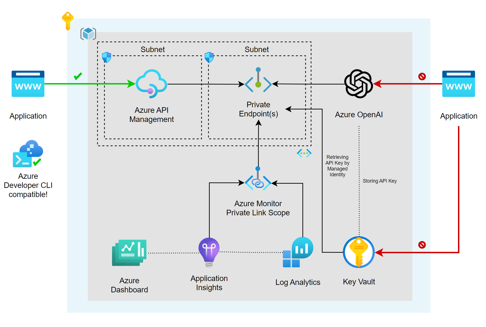
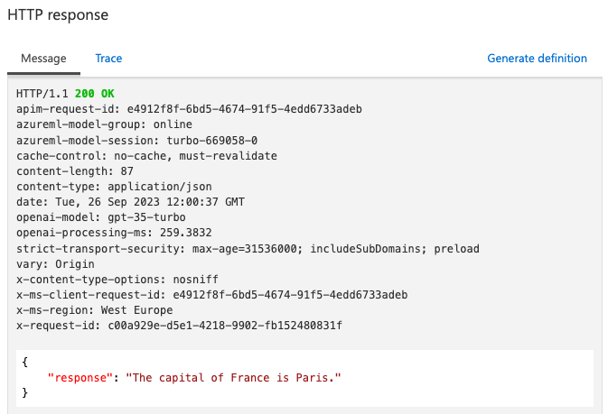

# Deploy Azure OpenAI

## Learning Objective

1. Understand the components of the [Azure OpenAI Landing Zone](https://techcommunity.microsoft.com/t5/azure-architecture-blog/azure-openai-landing-zone-reference-architecture/ba-p/3882102) reference architecture.
1. Deploy Azure OpenAI Service with API Management.

## Prerequisites

* GitHub account
* An Azure subscription
* Access to Azure OpenAI Service. Apply [here](https://aka.ms/oaiapply) for access.
* [Azure Developer CLI](https://learn.microsoft.com/en-us/azure/developer/azure-developer-cli/install-azd).

## Create a GitHub repository from a template

1. Navigate to [pascalvanderheiden/ais-apim-openai](https://github.com/pascalvanderheiden/ais-apim-openai) and login with your GitHub account.

1. Click the "Use this template" button, or click [here](https://github.com/new?template_name=ais-apim-openai&template_owner=pascalvanderheiden).

    

1. Select a repository name and click "Create repository".

    

1. You can choose to clone the repository locally, or create a codespace.

    > **Note:** If you opt to clone the repository locally, you will need to install the [Azure Developer CLI](https://learn.microsoft.com/en-us/azure/developer/azure-developer-cli/install-azd).

## Deploy Azure OpenAI with API Management

> **Note:** It can take up to 45 minutes to deploy Azure API Management. We recommend you start the deployment first and then spend some time familiarise yourself with the repository (see next section).

1. Initialize a new `azd` environment. `azd` will prompt you to provide a name that will later be used in the name of the deployed resources.

    ```
    azd init
    ```

    

1. Authenticate to Azure

    ```
    azd auth login
    ```

2. Provision and deploy all the resources

    ```
    azd up
    ```

    

    > **Note:** `azd` will prompt you to login, pick a subscription, and provide a location (like "eastus"). You can find more information about the availability of Azure OpenAI [here](https://azure.microsoft.com/en-gb/explore/global-infrastructure/products-by-region/?products=cognitive-services&regions=all).

    > **Note:** Sometimes the DNS Zones for the Private Endpoints aren't created correctly / in time. If you get an error when you deploy the resources, it may be required to redeploy.
    >
    > ```
    > azd up
    > ```

## Familiarise yourself with the repository
The repository you have created is based on the [Azure OpenAI Landing Zone](https://techcommunity.microsoft.com/t5/azure-architecture-blog/azure-openai-landing-zone-reference-architecture/ba-p/3882102) reference architecture. We will leverage the Infrastructure-as-code (IaC) under the `infra` folder to provision Azure OpenAI, Azure API Management, along with best practices for security, network isolation, monitoring, etc.

1. Review the [solution architecture](https://github.com/pascalvanderheiden/ais-apim-openai#architecture). Each component's purpose is described [here](https://github.com/pascalvanderheiden/ais-apim-openai/blob/main/README.md#additional-details).

    

1. Review the [Infrastructure-as-code (IaC)](https://github.com/pascalvanderheiden/ais-apim-openai/tree/main/infra).

## Test the API endpoint

1. Once the deployment has completed, navigate to the [Azure Portal](https://portal.azure.com) and open the resource group that was created by `azd`. Spend some time familiarising yourself with the resources that were deployed.

1. Open the API Management instance and click on "APIs".

1. Select the "Azure OpenAI Service API" API and open the "Creates a completion for the chat message" operation. 

1. Navigate to the "Test" tab.

    

1. Enter the following values under "Template parameters":

    * **deployment-id:** chat
    * **api-version:** 2023-03-15-preview

1. *(optional)* Under "Request body" update the prompt content to something like "Hello, my name is John. What is the capital of France?"

    ```json
    {"model":"gpt-35-turbo","messages":[{"role":"user","content":"Hello, my name is John. What is the capital of France?"}]}
    ```

1. Click "Send".

    

1. Scroll down, you will find the "HTTP response" with the response from the Azure OpenAI Service.

    

___
[Next Lab](./02-implement-chargeback.md)
