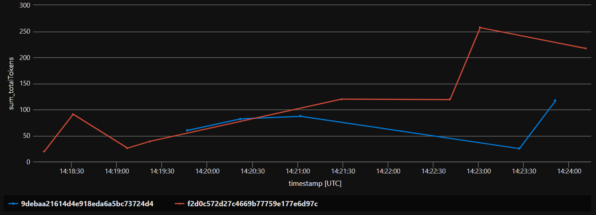

# Implement Chargeback
Azure OpenAI Service offers dedicated throughput, a feature that provides a dedicated connection to OpenAI models with guaranteed performance levels. 

Large organizations frequently provision a singular instance of Azure OpenAI Service that is shared across multiple internal departments. This shared-use necessitates an efficient mechanism for allocating costs to each business unit or consumer, based on the number of tokens consumed.

In this hack, you will discover how to implement chargeback for Azure OpenAI Service using Azure API Management.

> **Note:** This is **not** a guided lab. We will provide prompts, and reference material, but not step-by-step instructions.

## Prerequisites

* [.NET SDK](https://dotnet.microsoft.com/download)
* [Visual Studio Code](https://code.visualstudio.com/)
* [C# Dev Kit extension](https://marketplace.visualstudio.com/items?itemName=ms-dotnettools.csdevkit) for Visual Studio Code.
* [Azure Functions extension](https://marketplace.visualstudio.com/items?itemName=ms-azuretools.vscode-azurefunctions) for Visual Studio Code.

## Capture and log API usage to Event Hub 

1. Later, we'll use the `log-to-eventhub` policy to send API usage to the event hub. For this to work, you will need to [create an event hub](https://learn.microsoft.com/en-us/azure/event-hubs/event-hubs-create).

1. To remove the need for a shared access policy, [configure API Management managed identity](https://learn.microsoft.com/en-us/azure/api-management/api-management-howto-log-event-hubs#option-2-configure-api-management-managed-identity) to access the Event Hub.

1. [Create an API Management logger](https://learn.microsoft.com/en-us/azure/api-management/api-management-howto-log-event-hubs?tabs=PowerShell#logger-with-user-assigned-managed-identity-credentials) which can be used to log events to the Event Hub.

    > Create and manage API Management loggers by using the API Management REST API directly or by using tools including Azure PowerShell, a Bicep template, or an Azure Resource Management template.

    ```bicep
    resource ehLoggerWithUserAssignedIdentity 'Microsoft.ApiManagement/service/loggers@2022-04-01-preview' = {
        name: 'ContosoLogger1'
        parent: '<APIManagementInstanceName>'
        properties: {
            loggerType: 'azureEventHub'
            description: 'Event hub logger with user-assigned managed identity'
            credentials: {
                endpointAddress: '<EventHubsNamespace>.servicebus.windows.net'
                identityClientId: '<ClientID>'
                name: '<EventHubName>'
            }
        }
    }
    ```

1. [Create an API Management policy](https://learn.microsoft.com/en-us/azure/api-management/api-management-howto-log-event-hubs?tabs=bicep#configure-log-to-eventhub-policy) to log events to the Event Hub. This `outbound policy` will pull specific data from the body of the response and send this information to the previously configured Event Hub.

    ```xml
    <outbound>
        <base/>
        <choose>
            <when condition="@(context.Response.StatusCode == 200)">
                <log-to-eventhub logger-id="eventhub-logger" partition-id="0">
                    @{
                        var responseBody = context.Response.Body?.As<JObject>(true);
                        var usageBody = responseBody["usage"];
                        return new JObject(
                            new JProperty("timestamp", DateTime.UtcNow.ToString()),
                            new JProperty("appSubscriptionKey", context.Request.Headers.GetValueOrDefault("Ocp-Apim-Subscription-Key",string.Empty)),
                            new JProperty("promptTokens", usageBody["prompt_tokens"].ToString()),
                            new JProperty("completionTokens", usageBody["completion_tokens"].ToString()),
                            new JProperty("totalTokens", usageBody["total_tokens"].ToString())
                        ).ToString();
                    }
                </log-to-eventhub>
            </when>
        </choose>
    </outbound>
    ```

    > The logged data can be directly streamed to Azure Stream Analytics for real-time analytics or to Power BI for real-time dashboards. With Azure Event Grid, the same data can also be used to trigger workflows or automate tasks based on specific conditions met in the incoming responses.

1. [Create a C# function in Azure using Visual Studio Code](https://learn.microsoft.com/en-us/azure/azure-functions/create-first-function-vs-code-csharp) to process the tokens response data in Event Hub and send them to Application Insights telemetry.

    ```csharp
     [FunctionName("ChargeBackFunction")]
    public static async Task Run(
        [EventHubTrigger("openai-chargeback-hub", Connection = "EventHubConnectionString")] EventData[] eventHubMessages,            
        ILogger logger)
    {
        logger.LogInformation("Chargeback function triggered");
        try
        {
            foreach (var message in eventHubMessages)
            {
                string messageBody = Encoding.UTF8.GetString(message.EventBody.ToArray());

                logger.LogInformation($"Chargeback Data {messageBody}");

                var telemetryConfiguration = new TelemetryConfiguration
                {
                    ConnectionString = Environment.GetEnvironmentVariable("APPLICATIONINSIGHTS_CONNECTION_STRING")
                };
                var telemetryClient = new TelemetryClient(telemetryConfiguration);
                telemetryClient.TrackEvent("Function called with Chargeback Data", JsonConvert.DeserializeObject<Dictionary<string, string>>(messageBody));
                telemetryClient.Flush();

                await Task.FromResult(true);

            }
        }
        catch (Exception ex)
        {
            logger.LogError($"Something went wrong. Exception thrown: {ex.Message}");
        }
    }
    ```

1. Azure Functions should now streaming custom events in Application Insights. [Write a new query](https://learn.microsoft.com/en-us/azure/azure-monitor/logs/get-started-queries#write-a-new-query) to summarise cost data. We've include a couple of examples to get your started.

    ```kusto
    customEvents
    | where name == "Function called with Chargeback Data"
    | project   timestamp, 
                sub=tostring(customDimensions["appSubscriptionKey"]),
                promptTokens=toint(customDimensions["promptTokens"]),
                completionTokens=toint(customDimensions["completionTokens"]),
                totalTokens=toint(customDimensions["totalTokens"])
    ```

    ```kusto
    customEvents
    | where name == "Function called with Chargeback Data"
    | project   timestamp, 
                sub=tostring(customDimensions["appSubscriptionKey"]),
                promptTokens=toint(customDimensions["promptTokens"]),
                completionTokens=toint(customDimensions["completionTokens"]),
                totalTokens=toint(customDimensions["totalTokens"])
    | summarize sum(totalTokens) by sub, bin(timestamp, 1h)
    | render timechart 
    ```

    

1. To correlate the token usage to the correct Azure OpenAI Service billing meter, it would be useful to record the `deploymentId` in the event data. Update the   `log-to-eventhub` policy to output the `deploymentId` from the request.

    > **Tip:** The `deployment-id` can be accessed from the request context using the following expression - `context.Request.MatchedParameters["deployment-id"]`
